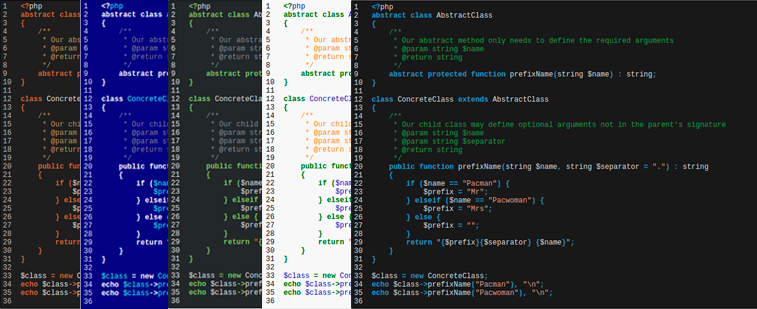

# Highlight
[](https://packagist.org/packages/oengine/highlight)
[](https://github.com/oengine/highlight/actions?query=workflow%3Arun-tests+branch%3Amain)
[](https://github.com/oengine/highlight/actions?query=workflow%3A"Fix+PHP+code+style+issues"+branch%3Amain)
[](https://packagist.org/packages/oengine/highlight)

OEngine\Highlight is a PHP library for highlighting syntax that can be easily configured and extended.

The library parses the text, finds the tag \<pre>, read attributes (data-lang, data-file, data-theme), and for this reason decides how to highlight the syntax of this block.
Supports style customization.

Here are examples of styling:



## Requirements

PHP 7.1+

## Installation

You can install package via composer

```bash
$ composer require oengine/highlight
```

## Usage

```php
<?php

require_once 'vendor/autoload.php';

use OEngine\Highlight\FormatCode;

$text = '
<pre data-file="php-highlight/examples/index.php" data-lang="php">
abstract class AbstractClass
{
    /**
     * Our abstract method only needs to define the required arguments
     * @param string $name
     * @return string
     */
    abstract protected function prefixName(string $name): string;
}

class ConcreteClass extends AbstractClass
{
    /**
     * Our child class may define optional arguments not in the parent\'s signature
     * @param string $name
     * @param string $separator
     * @return string
     */
    public function prefixName(string $name, string $separator = ".") : string
    {
        if ($name == "Pacman") {
            $prefix = "Mr";
        } elseif ($name == "Pacwoman") {
            $prefix = "Mrs";
        } else {
            $prefix = "";
        }
        return "{$prefix}{$separator} {$name}";
    }
}

$class = new ConcreteClass;
echo $class->prefixName("Pacman"), "\n";
echo $class->prefixName("Pacwoman"), "\n";
</pre>
';

echo FormatCode::Highlight($text, 'railscasts',true,true);
```

### Language syntax support

- PHP
- JavaScript
- XML/HTML
- Bash
- Go
- and others

### Themes

- default
- darkula
- railscasts
- obsidian
- far
- vs2015
- c64

### Customization

```php
// Show line numbers
$highlighter->setShowLineNumbers(true);
// Show action panel
$highlighter->setShowActionPanel(true);
```

You can set following attributes in \<pre> tag
\<pre data-lang="php" data-file="example.php" data-theme="drakuala">

- lang - a language of the text. This affects how the parser will highlight the syntax.
- file - show file name in action panel.
- theme - allows to overwrite the global theme.

## Contributing

Pull requests are welcome. For major changes, please open an issue first to discuss what you would like to change.

Please make sure to update tests as appropriate.

## License

[MIT](./LICENSE.md)
